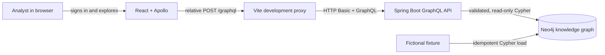

# Nexus

Nexus is a local OSINT link-analysis application for exploring entities and the
relationships between them as a Neo4j knowledge graph. The current release provides an
authenticated, read-only graph explorer backed by a deterministic fictional dataset, so
the complete workflow can be run and reviewed without downloading live personal data.


## What you can do

- Search people, organizations, vessels, and addresses by name or alias.
- Add search results to an interactive Cytoscape graph.
- Expand one-hop neighborhoods without losing the existing graph layout.
- Follow directed `OWNS`, `CONTROLS`, `OFFICER_OF`, and `LOCATED_AT` relationships.
- Distinguish verified identity links from uncertain `POSSIBLE_MATCH` leads.
- Inspect source-record provenance, dataset membership, and entity attributes.
- Query shortest paths through the authenticated GraphQL API.

The supported product surface is currently read-only. Live OFAC/EU/UN imports, entity
resolution writes, and saved investigations are represented in the repository roadmap
but are not available through the running application yet.

## Quick start

### Prerequisites

The tested local toolchain is:

| Tool | Version |
|---|---|
| Java | 25 (Amazon Corretto 25.0.1 tested) |
| Maven | 3.9.11 through the wrapper in `api/` |
| Node.js | 24.18.0 |
| npm | 11.16.0 |
| Docker with Compose | Docker 29.6.1 and Compose 5.3.1 tested |
| Neo4j | 5.26.28 Community, started by Docker Compose |

Python 3.13.12 and `uv` 0.10.4 are required only for ingestion development and the full
repository verification suite. See [Development](docs/development.md) for runtime
selection and component-specific commands.

### 1. Configure local credentials

From the repository root, create the untracked local environment file:

```bash
cp .env.example .env
```

Edit `.env` and replace both example passwords. Then export the same values in the shell
that will start Neo4j and the API:

```bash
export NEO4J_PASSWORD='your-local-neo4j-password'
export ANALYST_USERNAME='analyst'
export ANALYST_PASSWORD='your-local-analyst-password'
```

The repository `.env` file is read automatically by Docker Compose. A Spring Boot process
started directly by Maven does not read it, which is why the values are also exported.

### 2. Start and seed Neo4j

```bash
docker compose up -d neo4j
./scripts/apply-schema.sh
./scripts/load-fixture.sh
```

The schema and fixture are idempotent: running both scripts again does not create
duplicate fixture records. Neo4j Browser is available at
[http://localhost:7475](http://localhost:7475); the Bolt endpoint is
`bolt://localhost:7687`.

### 3. Start the GraphQL API

Keep the exported variables from step 1 and run:

```bash
SPRING_NEO4J_PASSWORD="$NEO4J_PASSWORD" \
  ./api/mvnw --file api/pom.xml spring-boot:run
```

The API listens on [http://localhost:8080/graphql](http://localhost:8080/graphql). It is
protected by HTTP Basic authentication, including schema-introspection requests.

### 4. Start the web application

Open a second terminal:

```bash
cd web
npm ci
NEXUS_API_TARGET=http://127.0.0.1:8080 npm run dev
```

Open the URL printed by Vite, normally [http://localhost:5173](http://localhost:5173),
and sign in with `ANALYST_USERNAME` and `ANALYST_PASSWORD` from step 1.

### 5. Explore the fictional graph

1. Search for `Avery` and select **Avery Stone**.
2. Choose **Expand selected** to reveal **Northstar Trading Ltd** and the directed
   `OWNS` relationship.
3. Select Northstar and expand it, then continue through **Blue Harbor Holdings** to
   the vessel **Aurora Tide**.
4. Select any node to inspect its source records and other details in the right panel.
5. Use **Re-layout** whenever you want Cytoscape to recalculate the visible layout.

All fixture people, organizations, addresses, identifiers, and relationships are
fictional. The full walkthrough and expected results are in the
[demo scenario](docs/demo-scenario.md).

## How Nexus works

Nexus keeps the browser, API, and database behind narrow boundaries:



The browser always calls the relative `/graphql` path. During local development, Vite
proxies that request to the Spring API configured by `NEXUS_API_TARGET`. This keeps the
browser same-origin and avoids embedding an API hostname or credentials in the build.

After sign-in, credentials are converted to a UTF-8 HTTP Basic header and kept only in
the active React/Apollo client. Nexus validates them with an authenticated GraphQL probe.
Signing out clears the Apollo cache and stops the client; the application does not put
credentials in local storage or session storage.

A search is validated by Spring and executed against Neo4j's `entity_name_search`
full-text index. Selecting a result adds that entity to the local graph. Expanding it
requests a bounded one-hop `GraphSlice` containing both nodes and directed edges. The
frontend adapter deduplicates stable IDs, rejects edges whose endpoints are absent, maps
API `sourceId`/`targetId` fields to Cytoscape `source`/`target`, and places new neighbors
around the selected anchor without moving existing nodes.

Entity details are loaded independently when a node is selected. The response joins the
entity to its publisher-controlled `SourceRecord`, stable `Dataset`, and `ImportRun`
provenance, while identity links retain their score and review metadata. An entity is
shown as sanctioned when at least one describing source record is active; that state is
derived at query time rather than copied onto the entity.

For the complete request sequences, limits, service responsibilities, and internal data
transformations, read [Architecture](docs/architecture.md). For labels, relationships,
IDs, and provenance, read [Data model](docs/data-model.md).

## GraphQL API

The authenticated query surface is:

| Query | Purpose | Important limits |
|---|---|---|
| `searchEntities` | Full-text entity and alias search | term 2–100 characters; result limit clamped to 1–50 |
| `entity` | Entity attributes, provenance, and identity-link explanations | ID must be non-blank and at most 512 characters |
| `neighborhood` | One-hop graph slice with nodes and directed edges | depth is exactly 1; up to 200 nodes and 500 edges |
| `shortestPath` | Shortest allowlisted path between two entity IDs | 1–6 hops |

Example:

```bash
curl --user "$ANALYST_USERNAME:$ANALYST_PASSWORD" \
  --header 'Content-Type: application/json' \
  --data '{"query":"query { searchEntities(term: \"Avery\") { score node { id displayName kind } } }"}' \
  http://127.0.0.1:8080/graphql
```

Invalid arguments are returned as GraphQL `BAD_REQUEST` errors. The nullable `entity` and
`shortestPath` queries return `null` when the requested entity or path is absent.

## Verification

Run the complete static/unit/integration suite from the repository root:

```bash
./scripts/verify.sh
```

Run the disposable browser proof separately:

```bash
./scripts/verify-phase-4.sh
```

The browser proof creates a temporary Neo4j container, applies the schema and fixture,
starts the API and web app with generated credentials, completes the Avery Stone workflow
in Chromium, checks that credentials were not persisted, and cleans up. It requires
Docker, OpenSSL, curl, installed web dependencies, and a Playwright Chromium binary.

See [Development](docs/development.md) for individual test commands and
[verification evidence](docs/verification/phase-4.md) for the recorded end-to-end result.

## Stopping and resetting

Stop the API and Vite with `Ctrl-C`, then stop Neo4j:

```bash
docker compose down
```

This preserves the named Neo4j data volume. To intentionally delete all local Nexus graph
data and return to an empty database:

```bash
docker compose down --volumes
```

## Troubleshooting

| Symptom | Check |
|---|---|
| Compose says `NEO4J_PASSWORD` is required | Create `.env`, or export `NEO4J_PASSWORD` before running Compose. |
| API fails during startup with a Neo4j authentication error | Ensure `SPRING_NEO4J_PASSWORD` matches the password used when the current Neo4j volume was created. |
| Sign-in reports incorrect credentials | Ensure the API process received `ANALYST_USERNAME` and `ANALYST_PASSWORD`; restart it after changing them. |
| Sign-in reports that the API is unavailable | Confirm the API is listening on port 8080 and Vite was started with the correct `NEXUS_API_TARGET`. |
| Search fails or returns nothing after a clean start | Run `./scripts/apply-schema.sh` and `./scripts/load-fixture.sh`; wait for indexes to finish. |
| Port 7474 does not show Neo4j Browser | Nexus maps Neo4j Browser to host port **7475**. |
| Maven uses the wrong Java | Run `sdk env` at the repository root or otherwise select Java 25 before using the wrapper. |
| Web commands use Node 20 | Select `.node-version` with your version manager and confirm `node --version` is `v24.18.0`. |
| Existing database rejects a newly changed password | Neo4j credentials persist in the named volume; use the original password or intentionally reset with `docker compose down --volumes`. |

## Security and responsible use

Nexus is a local, single-analyst demonstration. HTTP Basic authentication over local HTTP
does not provide transport encryption and is not suitable for an exposed or multi-user
deployment. Keep its ports bound to a trusted machine and do not use example passwords.

Graph links are investigative evidence, not legal conclusions. In particular,
`POSSIBLE_MATCH` means an uncertain lead and must not be presented as verified identity.
Nexus does not make a sanctions-compliance, due-diligence, or identity determination.
Users remain responsible for source licensing, data minimization, verification, and
lawful use. See [Security and limitations](docs/security-and-limitations.md).

## Documentation

- [Architecture and execution flows](docs/architecture.md)
- [Data model and provenance](docs/data-model.md)
- [Demo walkthrough](docs/demo-scenario.md)
- [Development and testing](docs/development.md)
- [Security and limitations](docs/security-and-limitations.md)
- [Implementation roadmap](PLAN.md)
