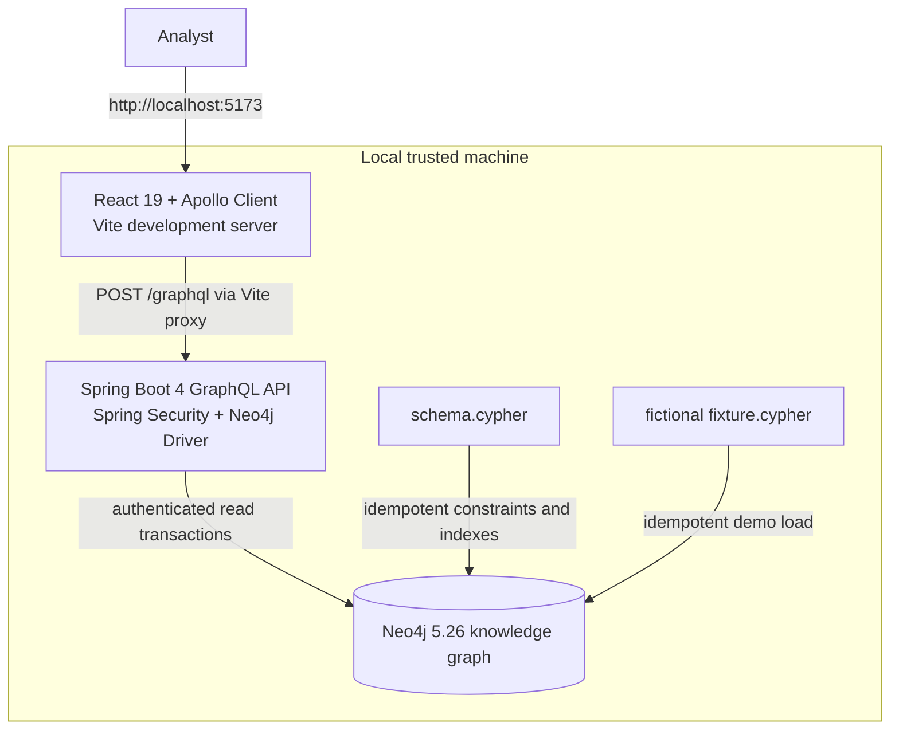
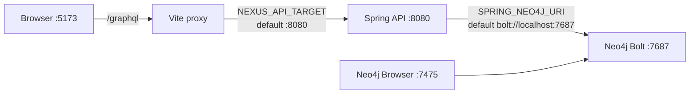
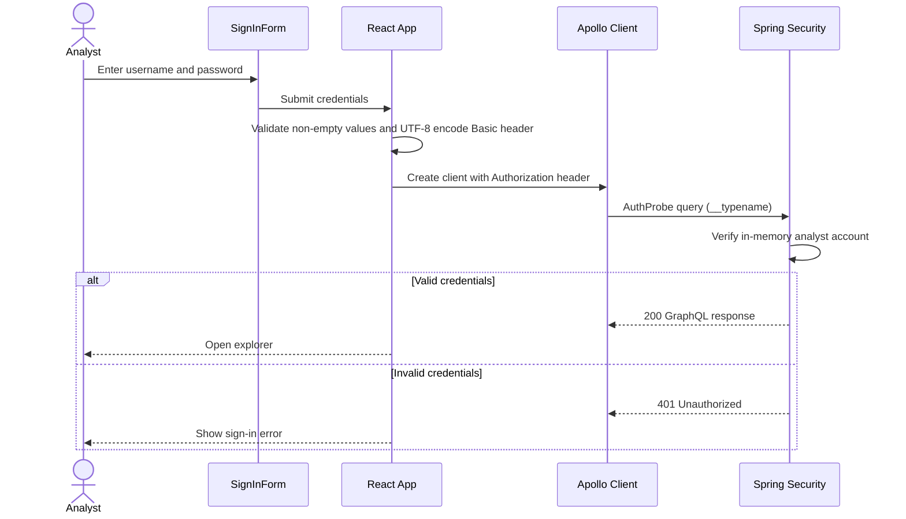
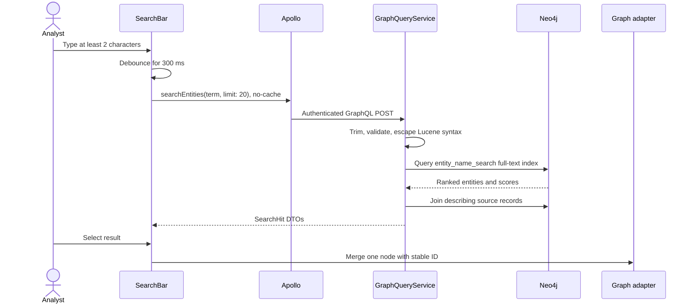
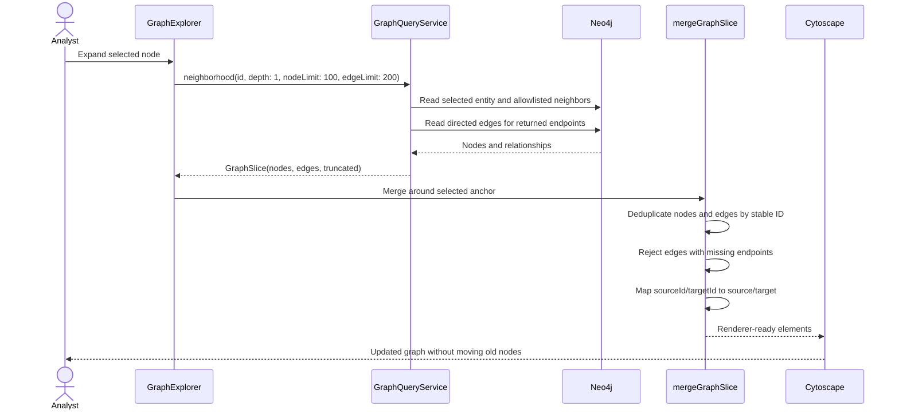
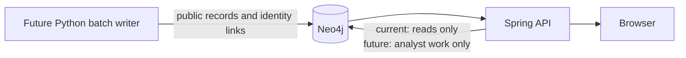
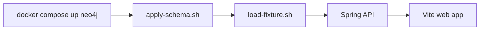

# Nexus architecture

Nexus is a local three-layer application: a React browser client sends authenticated
GraphQL reads to a Spring Boot API, and the API runs bounded Cypher against Neo4j. A
deterministic Cypher fixture supplies the supported demo data. The Python ingestion tree
is reserved for future batch writers and is not part of the currently runnable product.

## System context



Only Neo4j is containerized in the supported developer run path. The API and web client
run as local development processes. This is why Docker Compose reads `.env` while the API
must receive `SPRING_NEO4J_PASSWORD`, `ANALYST_USERNAME`, and `ANALYST_PASSWORD` through
its process environment.

## Component responsibilities

| Component | Owns | Does not own |
|---|---|---|
| React web client | Sign-in state, search interaction, visible graph state, selection, layout | Database access, authorization decisions, durable storage |
| Vite proxy | Forwards the browser's relative `/graphql` request to the configured local API | Authentication or business logic |
| Spring GraphQL API | Authentication, input validation, GraphQL contract, read-only graph queries, DTO mapping | Browser layout, public-data imports, entity mutation |
| Neo4j | Entity graph, provenance graph, schema constraints, search indexes | HTTP authentication, UI state |
| Schema/fixture scripts | Repeatable local database initialization | Long-running application behavior |
| Python `ingest/` package | Future batch ingestion and resolution boundary | Current supported runtime behavior; its commands are placeholders today |

The supported GraphQL controllers expose only queries. No current UI or query service
operation changes public-source nodes or relationships.

## Runtime topology



Set `NEXUS_API_TARGET` to an absolute `http://` or `https://` API URL. The browser never
uses the Compose service name `neo4j`; that name is only meaningful inside a future
all-container network. In the current host-run topology, Spring uses
`bolt://localhost:7687`.

## Authentication flow



Spring constructs one in-memory `ANALYST` user from process environment values when the
API starts. Security is stateless, so every GraphQL request must carry the Basic header.
CSRF is ignored only for `/graphql`; every other route is denied except authenticated
GraphQL/GraphiQL routes.

The browser keeps the authorization value inside the active Apollo client. It is not
written to browser local storage or session storage. On sign-out, React removes the
session, clears Apollo's normalized cache, and stops the client. This limits accidental
persistence but does not encrypt local HTTP traffic.

## Search flow



The UI cancels stale outcomes logically with a request-generation counter. If a user
types again before an older response arrives, that older response cannot replace the
newer results. Search results are ordered by Neo4j score and then stable entity ID.

The `sanctioned` field is calculated from provenance: it is true when at least one
`SourceRecord` describing the entity has `active = true`. Dataset IDs are collected from
those same records.

## Neighborhood expansion and graph rendering



Neighborhood queries traverse only these analyst-facing relationship types:

- `OWNS`
- `CONTROLS`
- `OFFICER_OF`
- `LOCATED_AT`
- `SAME_AS`
- `POSSIBLE_MATCH`

The relationship type list is fixed in Java and interpolated into Cypher only from that
constant; it is not user input. The API reads relationships in either direction so a
neighbor can be discovered from either endpoint, but each returned edge preserves its
stored source and target.

Neo4j returns API edges with `sourceId` and `targetId`. Cytoscape requires fields named
`source` and `target`, so `graphAdapter.ts` adds those renderer-specific aliases at the UI
boundary while retaining the original API fields. This explicit translation prevents the
UI library's shape from leaking into the GraphQL contract.

Existing node coordinates survive a merge. New unanchored search results use a small
grid; new expansion nodes are placed on a radius around the selected node. **Re-layout**
runs Cytoscape's COSE layout only when the analyst requests it.

If the API reports `truncated: true`, the UI warns that the neighborhood is incomplete.
If an edge references a node absent from the merged graph, the adapter drops it and logs
the stable edge ID instead of allowing a corrupt renderer state.

## Entity-detail and provenance flow

Selecting a graph node starts an independent `entity(id)` query. React again uses a
generation counter so details from a previously selected node cannot overwrite a newer
selection.

```mermaid
flowchart LR
    Entity["Entity"] <--|"DESCRIBES"| Record["SourceRecord"]
    Record -->|"FROM_DATASET"| Dataset["Dataset"]
    Record -->|"OBSERVED_IN"| Run["ImportRun"]
    Entity <-->|"SAME_AS or POSSIBLE_MATCH"| Other["Other Entity"]
```

The API returns entity attributes, programs gathered from source records, source record
IDs, publisher external IDs, dataset names, latest observed import time, record hashes,
active status, and identity-link explanations. `POSSIBLE_MATCH` is rendered with an
explicit warning because it is an investigative lead, not a verified identity claim.

## Shortest paths

The GraphQL API also exposes `shortestPath(fromId, toId, maxHops)`. It searches only the
same allowlisted relationship types used by neighborhood expansion, accepts a maximum of
1–6 hops, preserves edge direction in the response, and returns `null` when no path
exists. The current browser UI does not expose this operation; it is available to API
clients.

## Input and result boundaries

| Input/result | Boundary |
|---|---|
| Search term | 2–100 characters after trimming; Lucene control characters escaped |
| Search limit | Defaults to 20 and is clamped to 1–50 |
| Entity ID | Non-blank, maximum 512 characters |
| Neighborhood depth | Exactly 1 |
| Neighborhood node limit | 1–200; UI requests 100 |
| Neighborhood edge limit | 1–500; UI requests 200 |
| Shortest-path hops | 1–6 |

Invalid inputs become GraphQL `BAD_REQUEST` errors. The nullable `entity` and
`shortestPath` operations return `null` when no matching entity or path exists.

## Data ownership and future write boundary

The schema reserves separate ownership domains even though the current release is
read-only:



The intended invariant is that future Python import jobs own `Dataset`, `ImportRun`,
`SourceRecord`, source-created `Entity` nodes, factual relationships, and identity links.
Spring may read those records but must never edit them. Future investigation mutations
may write only `Investigation` and `INCLUDES` work-product records. The Python and Spring
processes do not call one another.

This boundary preserves what each source said even when an analyst groups, annotates, or
lays out entities later. It is a design contract for planned functionality, not a claim
that those write flows are currently available.

## Startup and shutdown

The database starts first, followed by idempotent schema and fixture initialization, then
the API, then Vite. The API must not start against a missing password; the web app can
start without the API but sign-in will report the service as unavailable.



`docker compose down` stops Neo4j but preserves its named data and log volumes.
`docker compose down --volumes` intentionally deletes them.
