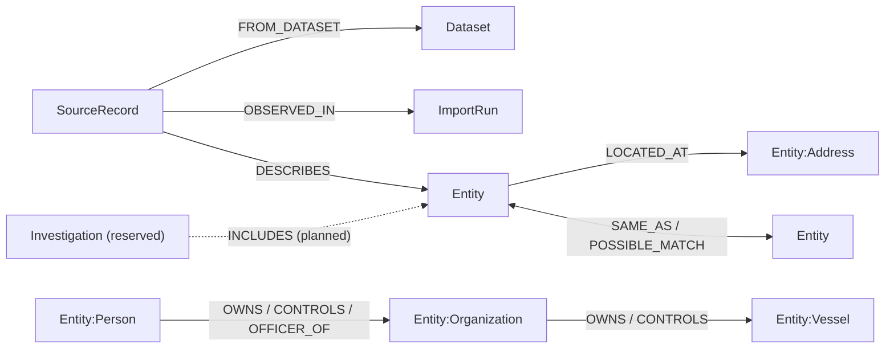
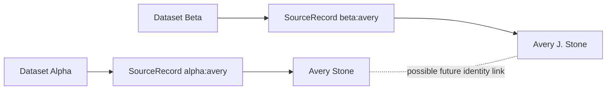
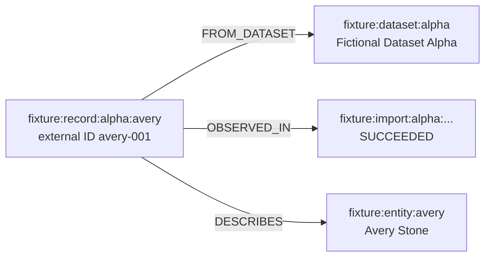

# Nexus data model

Nexus persists one Neo4j knowledge graph. The current schema separates browsable
entities, publisher provenance, import history, and analyst-facing relationships without
collapsing records from different sources.

This document describes the schema implemented by
`api/src/main/resources/schema.cypher` and exercised by the deterministic fixture and
integration tests. `Investigation` has a reserved uniqueness constraint, but saved
investigation behavior is not part of the current supported product.

## Graph overview

## Why provenance is separate

Three nodes answer three different questions:

| Node | Question answered | Lifetime |
|---|---|---|
| `Dataset` | Which publisher product supplied the data? | Stable across downloads |
| `ImportRun` | Which exact retrieval/import attempt observed it? | New for each attempt |
| `SourceRecord` | Which publisher-controlled record is this? | Stable across snapshots |

The browsable `Entity` is not a replacement for its source record. A source record
describes an entity through `DESCRIBES`, which allows two publishers to retain distinct
records and provenance even if later analysis links their entities.

No operation should merge or delete `E1` and `E2` solely because their names are
similar. Identity decisions are explicit graph relationships, so the underlying source
entities survive and can still be audited independently.

## Labels and core properties

### `Entity`

Every browsable domain object has the common `Entity` label and one concrete type label.

| Property | Purpose |
|---|---|
| `id` | Stable unique entity identifier |
| `kind` | `PERSON`, `ORGANIZATION`, `VESSEL`, or `ADDRESS` |
| `display_name` | Human-readable label used by search and graph rendering |
| `aliases` | Alternative names included in full-text search |
| `normalized_name` | Normalized comparison/search value for named entities |
| `normalized_address` | Normalized value used for addresses |

Concrete labels add type-specific fields:

| Label | Current/recognized properties |
|---|---|
| `Person` | `dates_of_birth`, `nationalities` |
| `Organization` | `jurisdiction`, `registration_number` |
| `Vessel` | `imo`, `flag` |
| `Address` | `normalized_address` |

The current deterministic fixture populates the shared fields and the vessel's `imo`
and `flag`. The API safely returns absent optional fields as `null` or empty lists.

### `Dataset`

| Property | Purpose |
|---|---|
| `id` | Stable dataset identifier |
| `name` | Display name |
| `publisher` | Source organization |
| `landing_url` | Publisher or local fixture landing location |

### `ImportRun`

| Property | Purpose |
|---|---|
| `id` | Unique import-attempt identifier |
| `dataset_id` | Dataset natural key retained for audit |
| `started_at`, `finished_at` | Retrieval/import timestamps |
| `status` | Outcome such as `SUCCEEDED` |
| `download_url` | Exact retrieval location |
| `sha256` | Downloaded content hash |
| count fields | Records inserted, updated, unchanged, and failed |

### `SourceRecord`

| Property | Purpose |
|---|---|
| `id` | Stable source-qualified record ID |
| `dataset_id` | Owning dataset key |
| `external_id` | Identifier assigned by the publisher |
| `record_hash` | Hash of the normalized source record |
| `first_seen_at`, `last_seen_at` | Observation window |
| `active` | Whether the record is active in the latest relevant snapshot |
| `programs` | Optional source program/list names used by entity details |

The API derives the UI's `sanctioned` boolean from active describing source records. It
does not require a mutable `sanctioned` property on `Entity`.

## Relationships

### Provenance relationships

| Relationship | From | To | Meaning |
|---|---|---|---|
| `FROM_DATASET` | `SourceRecord` | `Dataset` | The stable publisher product that owns the record |
| `OBSERVED_IN` | `SourceRecord` | `ImportRun` | A particular import run saw the record |
| `DESCRIBES` | `SourceRecord` | `Entity` | The source record supports this source-specific entity |

### Analyst-facing factual relationships

| Relationship | Typical endpoints | Meaning |
|---|---|---|
| `OWNS` | Person/Organization → Organization/Vessel | Stored ownership assertion |
| `CONTROLS` | Person/Organization → Organization/Vessel | Stored control assertion |
| `OFFICER_OF` | Person → Organization | Stored officer assertion |
| `LOCATED_AT` | Entity → Address | Stored location/address assertion |

Fixture factual edges contain `evidence_record_ids`, which identifies the source records
supporting the edge. The UI currently displays entity provenance; API DTOs do not yet
expose factual-edge evidence IDs.

### Identity relationships

| Relationship | Meaning | UI treatment |
|---|---|---|
| `SAME_AS` | Reviewed/accepted identity link between two preserved entities | Normal directed graph edge |
| `POSSIBLE_MATCH` | Uncertain candidate identity link | Dashed orange edge and explicit lead warning |

Identity links may carry `score`, `reasons`, `algorithm_version`, `decided_at`,
`decision_source`, and `review_status`. The detail query returns this explanation rather
than only a boolean identity result.

Stable edge IDs are derived from the stored source entity ID, relationship type, and
target entity ID. They remain stable across repeated queries and allow the UI to
deduplicate graph slices.

## Constraints and indexes

The idempotent schema creates these uniqueness constraints:

- `Entity.id`
- `Dataset.id`
- `ImportRun.id`
- `SourceRecord.id`
- `Investigation.id` (reserved for planned saved work)

It also creates:

- full-text index `entity_name_search` over `Entity.display_name` and `Entity.aliases`;
- composite lookup index for `SourceRecord(dataset_id, external_id)`;
- range index for `Vessel.imo`.

Neo4j constraints do not express every business invariant. The API, future writers, and
database-backed invariant tests must also enforce correct labels, endpoints,
cardinalities, and evidence properties.

## Invariant checks

The integration suite executes eight zero-violation queries:

1. every typed person/organization/vessel/address also has `Entity`;
2. every source record has exactly one dataset;
3. every active source record describes exactly one entity;
4. successful imports contain required metadata;
5. source-specific entities remain preserved;
6. identity links use canonical non-duplicate storage;
7. investigation membership, when present, targets only entities;
8. public factual relationships contain evidence IDs.

These checks live under `api/src/test/resources/invariants/` and run against a disposable
Neo4j database in `GraphContractIntegrationTest`.

## Deterministic fixture example

The bundled fixture creates this provenance chain for Avery Stone:

Avery then owns Northstar Trading Ltd, Northstar controls Blue Harbor Holdings, and Blue
Harbor owns Aurora Tide. Every ID is stable and every creation uses `MERGE`, making the
fixture safe to reload.

The isolated fixture contains 17 nodes and 21 relationships. See the
[demo scenario](demo-scenario.md) for the analyst workflow.

## Current write boundary

The supported application is read-only. Schema and fixture scripts are the only
supported writers in the demo flow. The architecture reserves a future division:

- Python batch jobs will own public datasets, imports, source records, source entities,
  factual relationships, and identity links.
- Spring will continue to read public data and may later write only analyst-owned
  `Investigation` and `INCLUDES` work product.

That future boundary is documented to prevent public-source facts from being silently
edited by analyst workflows; it is not a claim that ingestion or saved investigations
are implemented now.
