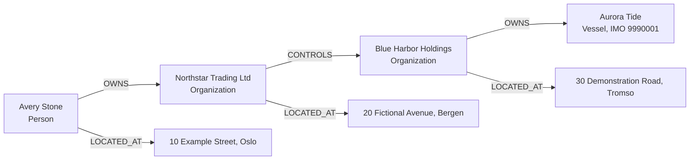

# Fictional demo scenario

The Nexus demo tells a complete link-analysis story using only fictional data. It begins
with a person, follows a directed ownership and control chain through two organizations,
and ends at a vessel. Every source name, identifier, address, and relationship in this
scenario exists only for testing and demonstration.

## Before you begin

Complete the [README quick start](../README.md#quick-start). The browser should show the
Nexus sign-in form, and the deterministic fixture should already be loaded.

The fixture contains this main path:

## Walkthrough

### 1. Sign in

Enter the analyst username and password supplied to the API process. Successful sign-in
proves both that the credentials are valid and that the browser can reach the API through
the Vite `/graphql` proxy.

### 2. Find the starting person

Type `Avery` in **Search entities**. Search starts after 300 ms and only after at least
two characters are present. Choose **Avery Stone** from the ranked results.

Expected result:

- Avery Stone appears on the graph as a blue person node.
- The node is selected automatically.
- The details panel shows entity ID `fixture:entity:avery`.
- The source record is `fixture:record:alpha:avery` from Fictional Dataset Alpha.

The red double border marks the entity as sanctioned in the demo. Nexus derives that
marker from an active source record; it is not a legal conclusion.

### 3. Reveal the first ownership link

Choose **Expand selected**.

Expected result:

- Northstar Trading Ltd and Avery's fictional Oslo address appear around the person.
- The relationship list contains a directed edge from Avery to Northstar with type
  `OWNS`.
- Existing nodes stay in place; new nodes are arranged around Avery.

Select **Northstar Trading Ltd**. Its details show source record
`fixture:record:alpha:northstar`. This is the provenance behind the entity in the demo
graph.

### 4. Follow control to the second organization

With Northstar selected, choose **Expand selected** again.

Expected result:

- Blue Harbor Holdings appears as a green organization node.
- A directed `CONTROLS` edge runs from Northstar to Blue Harbor.
- Northstar's fictional Bergen address also becomes available.

### 5. Reach the vessel

Select **Blue Harbor Holdings** and expand it.

Expected result:

- Aurora Tide appears as an amber diamond-shaped vessel node.
- A directed `OWNS` edge runs from Blue Harbor to Aurora Tide.
- The API's entity detail for the vessel contains IMO `9990001` and flag `NO`.

At this point the analyst has traced a three-edge path from a person to a vessel without
losing the source-specific entities that support the graph.

### 6. Inspect the unresolved identity lead

Search for `Avery J. Stone`. The fixture deliberately contains this second person from
Fictional Dataset Beta. It remains a separate entity from Avery Stone.

The fixture does not assert `SAME_AS` or `POSSIBLE_MATCH` between them. Their similar
names are useful for demonstrating why name similarity alone must not merge identities.
If a future resolution process adds `POSSIBLE_MATCH`, Nexus must show it as an uncertain
lead with its score and reasons.

## Reading the graph

| Visual | Meaning |
|---|---|
| Blue ellipse | Person |
| Green rounded rectangle | Organization |
| Amber diamond | Vessel |
| Purple hexagon | Address |
| Red double border | At least one active describing source record |
| Solid directed edge | Factual or accepted graph relationship |
| Dashed orange `POSSIBLE_MATCH` edge | Uncertain identity lead requiring review |

The text summary beneath the canvas lists all visible nodes and relationships, including
the stable source ID, relationship type, and stable target ID. It provides a readable
alternative to interpreting the canvas alone.

## Fixture contract

The isolated fixture contains:

- 2 `Dataset` nodes;
- 2 successful `ImportRun` nodes;
- 5 `SourceRecord` nodes;
- 8 entities: 2 people, 2 organizations, 1 vessel, and 3 addresses;
- 17 total nodes and 21 total relationships.

The fixture uses stable IDs and `MERGE`, so loading it twice leaves these totals
unchanged. Its exact contents are documented in
[`fixtures/demo/README.md`](../fixtures/demo/README.md).

## Automated proof

`./scripts/verify-phase-4.sh` automatically proves the first portion of this story in a
fresh environment: sign in, search for Avery, add Avery Stone, expand once, find
Northstar and the directed `OWNS` link, and inspect Avery's provenance. The recorded
result is in [Phase 4 verification](verification/phase-4.md).
