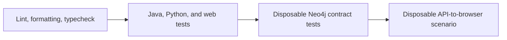

# Developing Nexus

This guide covers the tested toolchain, component commands, verification layers, and
repository layout. The [root README](../README.md) is the operational guide for running
the local product.

## Toolchain

| Layer | Project contract | Tested version |
|---|---|---|
| Java | Java 25 | Amazon Corretto 25.0.1 |
| Maven | Wrapper under `api/` | 3.9.11 |
| Spring Boot | Exact POM version | 4.0.0 |
| Python | CPython 3.13 | 3.13.12 |
| uv | Exact project manager version | 0.10.4 |
| Node.js | Node 24 LTS | 24.18.0 |
| npm | Bundled with selected Node | 11.16.0 |
| Neo4j | Community 5.26 LTS | 5.26.28 |
| Docker Engine | Local container runtime | 29.6.1 |
| Docker Compose | Docker plugin | 5.3.1 |

The Neo4j Compose service and integration tests use this immutable Linux AMD64 image:

```text
neo4j:5.26.28-community@sha256:20779498e70e05772836fb980449bf691f519b42d87372e3f499312cb32c5430
```

Version-manager files at the repository root are the executable contract:

- `.java-version` selects Java 25.0.1.
- `.sdkmanrc` selects Amazon Corretto 25.0.1 and Maven 3.9.11.
- `.python-version` selects Python 3.13.12.
- `.node-version` selects Node 24.18.0.

Do not rely on the host defaults. In particular, a shell can still resolve an older Java
or Node installation after entering the repository.

## First-time setup

Select the runtimes with the version managers installed on your machine. For SDKMAN and
NVM, a typical setup is:

```bash
sdk env
nvm use
java --version
node --version
npm --version
```

Expected Java major is 25, Node is `v24.18.0`, and npm is `11.16.0`.

Install locked web dependencies:

```bash
cd web
npm ci
cd ..
```

Create the locked Python environment:

```bash
cd ingest
uv sync --frozen --python 3.13.12
cd ..
```

The Maven wrapper downloads Maven and project dependencies as needed on its first run.
Integration and browser tests also require a working Docker daemon.

For the browser proof, install Playwright's Chromium binary once:

```bash
cd web
npx playwright install chromium
cd ..
```

## Repository layout

```text
.
├── api/                    Spring Boot GraphQL API and Neo4j contract tests
├── web/                    React, Apollo, Cytoscape, Vitest, and Playwright
├── ingest/                 Python batch-package scaffold and future source adapters
├── fixtures/demo/          deterministic fictional data
├── fixtures/public-demo/   review process for any optional public evidence
├── scripts/                schema, fixture, verification, and runtime helpers
├── docs/                   architecture, model, demo, security, and evidence
├── docker-compose.yml      local Neo4j service and named volumes
└── PLAN.md                 implementation roadmap and acceptance gates
```

The Java project is a single Maven module under `api/`. There is intentionally no root
`pom.xml`; root-level Maven commands must use `--file api/pom.xml`.

## Component commands

### API

Run all Java tests from the repository root:

```bash
./api/mvnw --file api/pom.xml test
```

Compile without tests:

```bash
./api/mvnw --file api/pom.xml -DskipTests compile
```

Run the API against local Neo4j:

```bash
export SPRING_NEO4J_PASSWORD="$NEO4J_PASSWORD"
export ANALYST_USERNAME='analyst'
export ANALYST_PASSWORD='your-local-analyst-password'
./api/mvnw --file api/pom.xml spring-boot:run
```

The default profile disables GraphiQL. To enable it locally, add the development profile:

```bash
./api/mvnw --file api/pom.xml spring-boot:run \
  -Dspring-boot.run.profiles=dev
```

GraphiQL remains protected by HTTP Basic authentication.

### Web

Run the development server:

```bash
cd web
NEXUS_API_TARGET=http://127.0.0.1:8080 npm run dev
```

Run each quality gate:

```bash
npm run lint
npm run test -- --run
npm run typecheck
npm run build
```

`npm test` without `-- --run` starts Vitest in watch mode. The production build includes
type checking before Vite builds `web/dist`.

### Python ingestion package

The package baseline can be checked with:

```bash
cd ingest
uv run --frozen ruff check .
uv run --frozen ruff format --check .
uv run --frozen pytest
uv run --frozen nexus-ingest --help
```

The help command is supported, but the `source ofac`, `source eu`, `source un`, and
`resolve` operations intentionally return an error because their end-to-end batch flows
are not implemented yet.

### Database

Create `.env`, export the matching `NEO4J_PASSWORD`, and start Neo4j before using these
commands:

```bash
docker compose up -d neo4j
./scripts/apply-schema.sh
./scripts/load-fixture.sh
```

The scripts use a locally installed `cypher-shell` when available. Otherwise, they run
`cypher-shell` inside the Compose-managed Neo4j container. Both wait for Neo4j before
continuing.

To verify the fixture totals:

```bash
docker compose exec -T neo4j cypher-shell \
  -u neo4j -p "$NEO4J_PASSWORD" \
  'MATCH (n) WITH count(n) AS nodes MATCH ()-[r]->() RETURN nodes, count(r) AS relationships'
```

The isolated fixture result is 17 nodes and 21 relationships.

## Verification strategy

Nexus separates fast component checks from database-backed and browser-backed proof.



### Repository verification

From the repository root:

```bash
./scripts/verify.sh
```

This runs:

1. Maven tests, including Testcontainers-backed Neo4j integration checks;
2. frozen Python sync, interpreter assertion, Ruff checks, Pytest, and CLI help;
3. locked web install, ESLint, Vitest, type checking, and build;
4. Docker Compose configuration validation and a floating-image guard.

The script supplies verification-only defaults to the processes it launches. Those
defaults are not product credentials and are not written to `.env`.

### Browser verification

```bash
./scripts/verify-phase-4.sh
```

The script creates a disposable Neo4j container on port 17687, starts the API on 18080,
starts Vite on 15173, and runs the Playwright scenario. It generates credentials with
OpenSSL and cleans up on success. Override ports when they are already occupied:

```bash
PHASE4_NEO4J_PORT=27687 \
PHASE4_API_PORT=28080 \
PHASE4_WEB_PORT=25173 \
  ./scripts/verify-phase-4.sh
```

On failure, logs remain in the `/tmp/nexus-phase4.*` directory printed by the script.

## CI

`.github/workflows/verify.yml` selects the repository runtimes and invokes the same
component commands used locally. A green local unit test is not equivalent to browser
proof: renderer-boundary and proxy mistakes can appear only in a real browser/API run.

## Configuration reference

| Variable | Consumer | Required | Default/meaning |
|---|---|---|---|
| `NEO4J_PASSWORD` | Docker Compose and database scripts | Yes | Neo4j local password; no safe default |
| `NEO4J_USERNAME` | Database scripts | No | `neo4j` |
| `NEO4J_URI` | Database scripts | No | `bolt://127.0.0.1:7687` |
| `SPRING_NEO4J_URI` | Spring API | No | `bolt://localhost:7687` |
| `SPRING_NEO4J_USERNAME` | Spring API | No | `neo4j` |
| `SPRING_NEO4J_PASSWORD` | Spring API | Yes | Must match the running database |
| `ANALYST_USERNAME` | Spring API | Yes | Single local analyst username |
| `ANALYST_PASSWORD` | Spring API | Yes | Single local analyst password |
| `NEXUS_API_TARGET` | Vite | No | `http://localhost:8080`; must be absolute HTTP(S) |
| `OPEN_CORPORATES_API_TOKEN` | Future optional enrichment | No | Currently unused by the supported run path |

## Common development failures

### Spring cannot authenticate to Neo4j

Docker Compose reads root `.env`; Maven/Spring does not. Export
`SPRING_NEO4J_PASSWORD` explicitly. If the named volume already exists, Neo4j continues
to use the password from its first initialization.

### Search reports an index error

Run `./scripts/apply-schema.sh` and wait for indexes. The script calls
`db.awaitIndexes(60)` after applying the idempotent schema.

### The browser cannot reach the API

Start Vite with `NEXUS_API_TARGET=http://127.0.0.1:8080`, or point it to the actual API
port. The value must include `http://` or `https://`.

### A test passes under the wrong runtime

Check `java --version`, `node --version`, and `uv run --frozen python --version` directly.
Repository version files do not force every shell or IDE to switch automatically.

### Frozen Python sync fails

Use Python 3.13.12 and uv 0.10.4. Do not regenerate `uv.lock` as a workaround unless the
dependency contract is intentionally being changed and reviewed.

### Playwright cannot launch Chromium

Install the browser for the selected web environment with
`npx playwright install chromium`. In environments that lack browser system libraries,
follow Playwright's platform-specific dependency instructions.

## Evidence and design records

- [Phase 4 browser verification](verification/phase-4.md)
- [Implementation plan](../PLAN.md)
