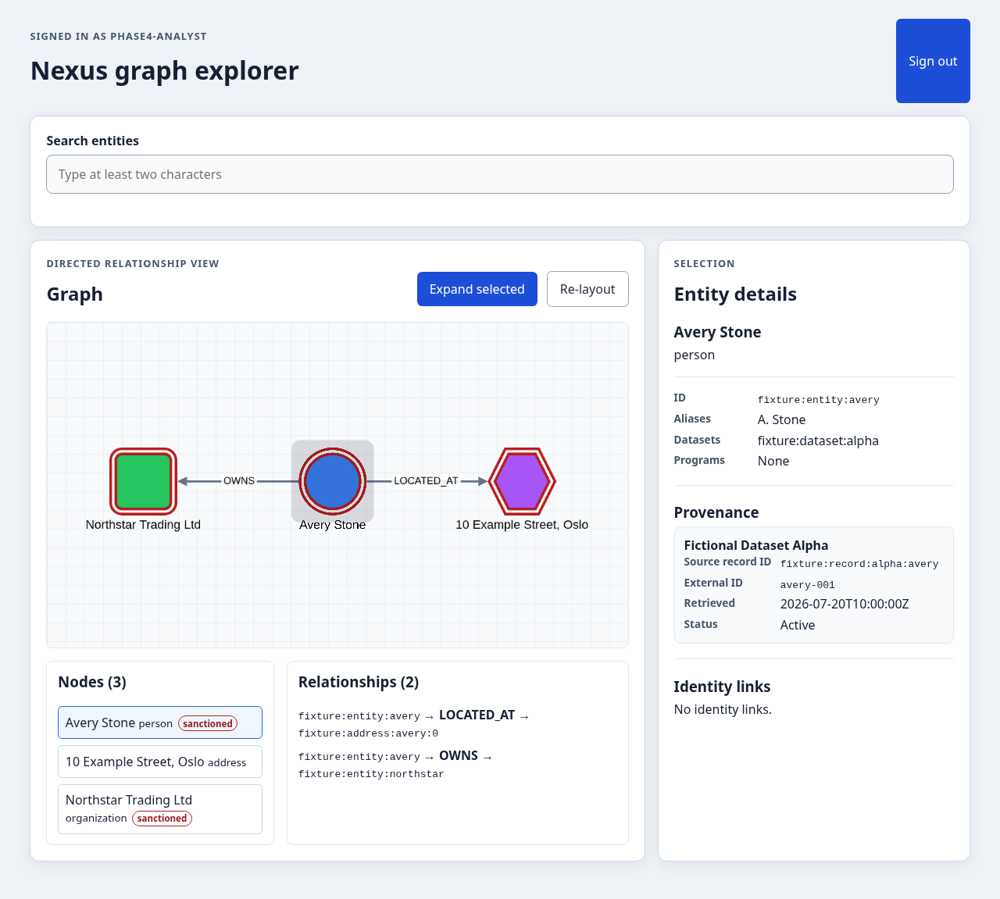

# Phase 4 verification

Verified on 2026-08-04 against a disposable Neo4j 5.26.28 database loaded from
`fixtures/demo/fixture.cypher`.

## Automated checks

| Check | Result |
|---|---|
| `npm run lint` | Passed |
| `npm run test -- --run` | Passed: 8 files, 23 tests |
| `npm run typecheck` | Passed |
| `npm run build` | Passed |
| `./mvnw -q -DskipTests compile` | Passed |
| `./mvnw -q -Dtest=ContextLoadsSmokeTest test` | Passed |
| `./scripts/verify-phase-4.sh` | Passed: 1 Chromium smoke test |

The smoke harness creates a new disposable Neo4j container, applies the schema, loads the
fixture, starts the Spring API and Vite proxy with generated runtime credentials, runs the
browser test, and removes all three processes/resources afterward.

## Browser path

The automated browser test completed this path:

1. entered generated runtime Basic credentials;
2. searched for `Avery` through the relative `/graphql` Vite proxy;
3. added `Avery Stone` to the graph;
4. expanded the selected person once;
5. found `Northstar Trading Ltd` and the directed `OWNS` relationship;
6. opened `fixture:record:alpha:avery` in the provenance panel;
7. confirmed browser local and session storage remained empty.

The verification script also checked that the generated analyst password was absent from
the production `web/dist` assets.

## Screenshot

